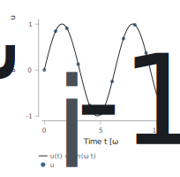
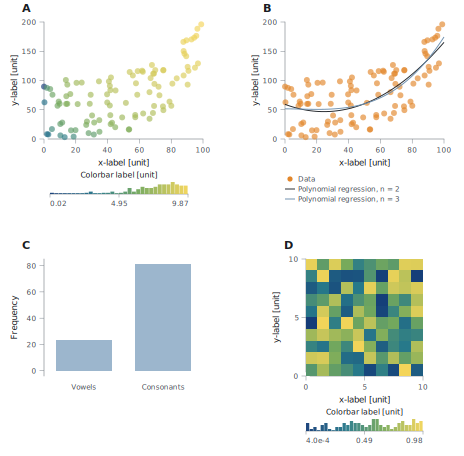
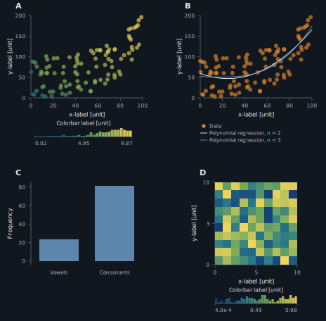
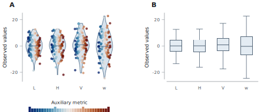
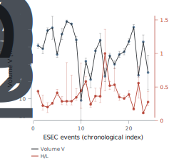

# Gallery

`cleanfig` is designed to stay compact at the API level: create a figure, select a panel, add layers, then export.

This gallery shows the shipped examples together with the actual plotting code patterns used to build them.

<style>
.cf-hero {
  margin: 1.2rem 0 1.8rem 0;
  padding: 1.4rem 1.5rem;
  border: 1px solid #d7dde5;
  border-radius: 18px;
  background:
    radial-gradient(circle at top right, rgba(222, 230, 238, 0.85), transparent 28%),
    linear-gradient(180deg, #ffffff 0%, #f7f9fb 100%);
  box-shadow: 0 10px 28px rgba(18, 26, 36, 0.06);
}
.cf-hero h2 {
  margin: 0 0 0.4rem 0;
}
.cf-hero p {
  margin: 0.35rem 0;
  line-height: 1.5;
}
.cf-kpis {
  display: grid;
  grid-template-columns: repeat(auto-fit, minmax(140px, 1fr));
  gap: 0.8rem;
  margin-top: 1rem;
}
.cf-kpi {
  padding: 0.8rem 0.9rem;
  border-radius: 12px;
  background: #ffffff;
  border: 1px solid #e1e7ee;
}
.cf-kpi strong {
  display: block;
  font-size: 1rem;
}
.cf-kpi span {
  color: #52606d;
  font-size: 0.92rem;
}
.cf-section {
  margin: 2.2rem 0 2.8rem 0;
  padding-bottom: 2rem;
  border-bottom: 1px solid #e5eaf0;
}
.cf-section:last-of-type {
  border-bottom: 0;
}
.cf-shot {
  margin: 1rem 0 1rem 0;
  padding: 0.9rem;
  border: 1px solid #dde4ec;
  border-radius: 16px;
  background: #fbfcfd;
}
.cf-shot img {
  width: 100%;
  height: auto;
  display: block;
  border-radius: 10px;
}
.cf-links {
  margin: 0.75rem 0 0.25rem 0;
}
.cf-links a {
  margin-right: 1rem;
}
.cf-note {
  color: #556270;
  font-size: 0.96rem;
}
</style>

<div class="cf-hero">
  <h2>What The API Looks Like</h2>
  <p>The core workflow is always the same: <code>cf.figure(...)</code>, <code>fig.panel(row, col)</code>, then methods such as <code>line</code>, <code>scatter</code>, <code>field</code>, <code>violin</code>, <code>box</code>, <code>legend</code>, and <code>colorbar</code>.</p>
  <p>The examples below are intentionally small and readable. They show how the library is meant to be used in real scripts, not just what the outputs look like.</p>
  <div class="cf-kpis">
    <div class="cf-kpi"><strong>1 figure object</strong><span>global size, theme, grid</span></div>
    <div class="cf-kpi"><strong>1 panel handle</strong><span>selected with <code>fig.panel(...)</code></span></div>
    <div class="cf-kpi"><strong>Layer methods</strong><span><code>line</code>, <code>scatter</code>, <code>field</code>, <code>violin</code></span></div>
    <div class="cf-kpi"><strong>Direct export</strong><span>SVG, HTML, PDF</span></div>
  </div>
</div>

## `basic_line`

Minimal line + scatter figure with math-aware labels and a compact legend.

<div class="cf-shot">
  
</div>

<div class="cf-links">
  <a href="assets/basic_line.svg">SVG</a>
</div>

```python
import numpy as np
import cleanfig as cf

x = np.linspace(0.0, 10.0, 200)
y = np.sin(x)

fig = cf.figure(width="single", height=3.4, grid=(1, 1), theme="light")
ax = fig.panel(0, 0)
ax.line(x, y, label=r"$u(t) = \sin(\omega t)$")
ax.scatter(x[::20], y[::20], size=4.2, label=r"$u_i$")
ax.xlabel(r"Time $t$ [$\omega^{-1}$]")
ax.ylabel(r"$\partial_t u$")
ax.legend()
```

## `four_panels_light`

Publication-theme multi-panel layout mixing mapped scatter, regression lines, bars, and a field plot with colorbar.

<div class="cf-shot">
  
</div>

<div class="cf-links">
  <a href="assets/four_panels_light.svg">SVG</a>
</div>

```python
fig = cf.figure(width="double", height=8.0, grid=(2, 2), panel_labels=True, theme="publication")

ax = fig.panel(0, 0)
sc = ax.scatter(x, y, color=np.log(x * y), size=6, alpha=0.65)
ax.xlabel("x-label [unit]")
ax.ylabel("y-label [unit]")
ax.limits(x=(0, 100), y=(0, 200))
ax.colorbar(sc, label="Colorbar label [unit]", placement="inside-left")

ax = fig.panel(1, 0)
ax.bar(["Vowels", "Consonants"], [23, 81])
ax.ylabel("Frequency")

ax = fig.panel(1, 1)
field = ax.field(x_map, cmap="batlow")
ax.xlabel("x-label [unit]")
ax.ylabel("y-label [unit]")
ax.colorbar(field, label="Colorbar label [unit]")
```

## `four_panels_dark`

Same figure logic, same script entry point, but with the optional dark presentation theme.

<div class="cf-shot">
  
</div>

<div class="cf-links">
  <a href="assets/four_panels_dark.svg">SVG</a>
</div>

```python
from four_panels import main

if __name__ == "__main__":
    main(theme="dark", stem="four_panels_dark")
```

<div class="cf-note">
The API does not change between light and dark variants. Only the <code>theme</code> argument does.
</div>

## `violin_box_light`

Distribution comparison with a violin panel, mapped points, and a companion box plot.

<div class="cf-shot">
  
</div>

<div class="cf-links">
  <a href="assets/violin_box_light.svg">SVG</a>
</div>

```python
all_data = [np.random.normal(0, std, 100) for std in range(6, 10)]

fig = cf.figure(width="double", height=4.0, grid=(1, 2), panel_labels=True, theme="publication")

ax = fig.panel(0, 0)
metric = [np.linspace(0, 1, len(group)) for group in all_data]
handle = ax.violin(
    all_data,
    labels=["L", "H", "V", "w"],
    show_median=True,
    points=True,
    point_color=metric,
    point_cmap="vik",
)
if handle is not None:
    ax.colorbar(handle, label="Auxiliary metric")

ax = fig.panel(0, 1)
ax.box(all_data, labels=["L", "H", "V", "w"])
```

## `esec_dual_y_light`

Dual-Y geophysical example built from a bundled ESEC catalog with `pandas`, log scaling, and uncertainty bands.

<div class="cf-shot">
  
</div>

<div class="cf-links">
  <a href="assets/esec_dual_y_light.svg">SVG</a>
</div>

```python
df = pd.read_csv("examples/Data/IRIS_DMC_esecEventsDb.txt", sep="|", low_memory=False)

fig = cf.figure(width="double", height=3.8, grid=(1, 1), theme="light")
ax = fig.panel(0, 0)

ax.errorbar(x, volume, ymin=volume_low, ymax=volume_high, width=0.65, alpha=0.35)
ax.line(x, volume, width=0.9, alpha=0.9, label="Volume V")
ax.scatter(x, volume, size=3.6, alpha=0.8)
ax.yscale("log")
ax.ylabel("Volume V [m^3] (log)")

ax.errorbar(x, mobility, ymin=mobility_low, ymax=mobility_high, width=0.65, alpha=0.35, yaxis="right")
ax.line(x, mobility, width=0.9, alpha=0.9, label="H/L", yaxis="right")
ax.scatter(x, mobility, size=3.6, alpha=0.8, yaxis="right")
ax.right_ylabel("H/L [-]")
ax.legend()
```

## Notes

- Dense field plots support <code>render="auto"</code>, <code>render="grid"</code>, and <code>render="embedded"</code>.
- PDF export requires the Rust backend.
- The ESEC example expects <code>pandas</code> and the bundled catalog file in <code>examples/Data/</code>.
