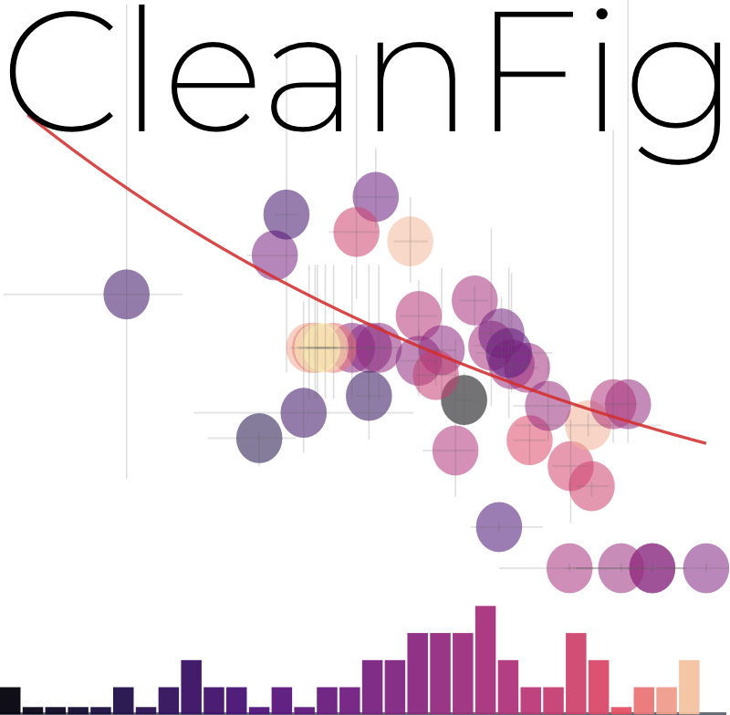

  

# cleanfig
Clean, opinionated, vector-first scientific plotting for Python.

`cleanfig` is a small Rust/Python plotting library for clean, publication-style, vector-first scientific figures.

It focuses on a compact API, light visual defaults, and direct export to SVG, HTML, and PDF.

## Links

- [Gallery](gallery/)
- [GitHub repository](https://github.com/adakite/cleanfig)
- [Issue tracker](https://github.com/adakite/cleanfig/issues)
- [PyPI project](https://pypi.org/project/cleanfig/)

## Highlights

- publication-first light theme by default
- optional dark theme for presentations
- vector-first SVG output
- auto grid/embedded rendering for dense field plots
- PDF export from the Rust backend
- dual Y axes
- linear and log axes
- compact legends and integrated colorbars
- violin, box, histogram, field, scatter, and line plots
- built-in colormaps: `magma`, `gray`, `bone`, plus a richer Fabio Crameri subset including `batlow`, `vik`, `roma`, `broc`, `cork`, `lapaz`, `lajolla`, `tokyo`, `navia`, `oslo`, and more

Fabio Crameri colormap citation:
`Crameri, F. (2023). Scientific colour maps (8.0.1). Zenodo. https://doi.org/10.5281/zenodo.8409685`

## Example Gallery

The gallery includes all currently shipped example figures:

- `basic_line`
- `esec_dual_y_light`
- `four_panels_figure`
- `four_panels_light`
- `four_panels_dark`
- `violin_box_light`
- `violin_box_dark`
- `weather_timeserie_check`
- `notebook_example`

Go directly to [the gallery](gallery/) to browse the outputs.
